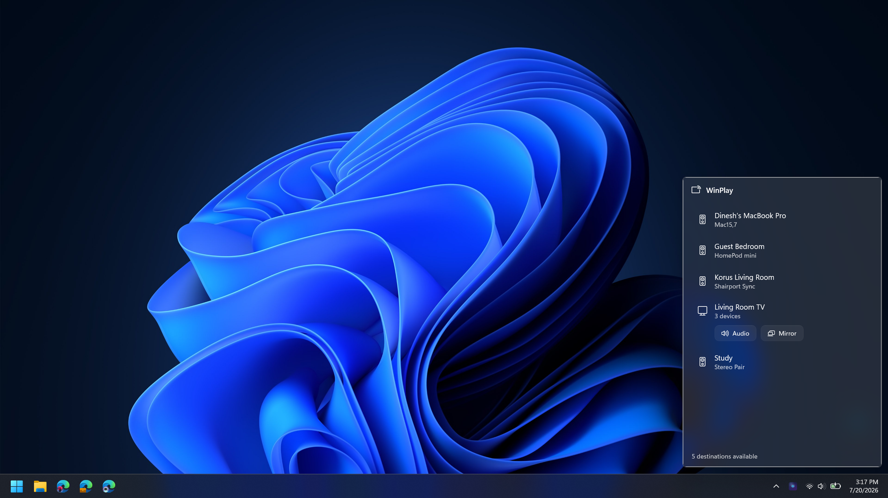
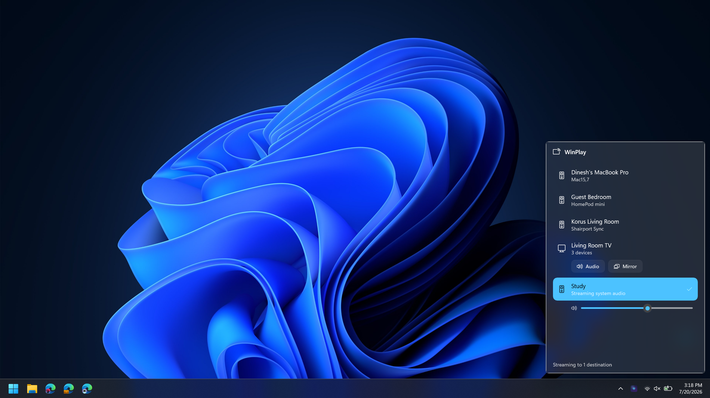
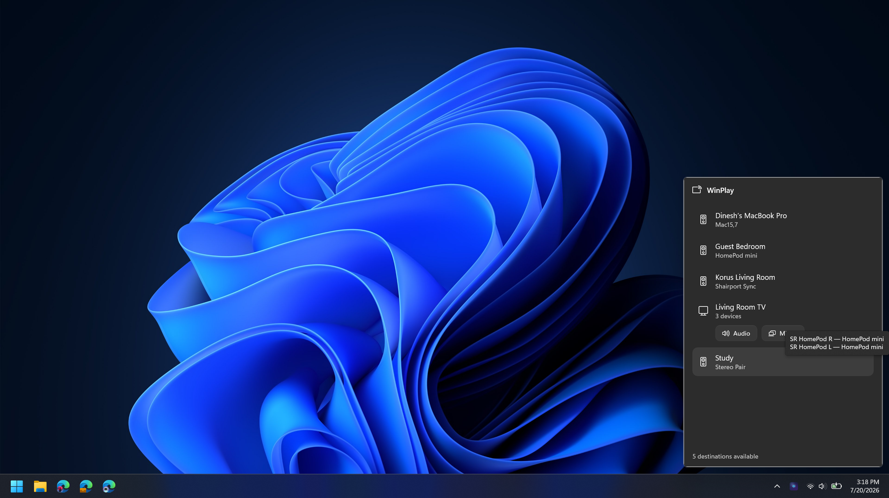
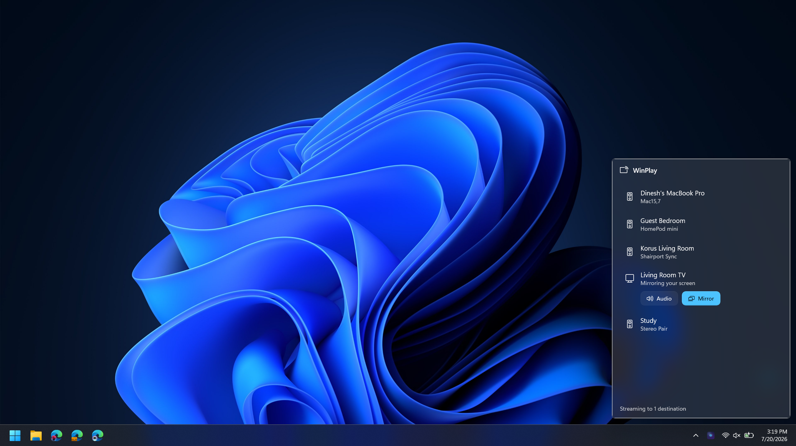

<div align="center">


# WinPlay

**A native Windows AirPlay 2 sender.** Stream your PC's audio to HomePods, stereo pairs
and multi-room groups — and mirror your screen to Apple TV — with an iOS‑style picker
that lives in your system tray.

[](https://github.com/dineshdhotrad/WinPlay/actions/workflows/ci.yml)
[](LICENSE)
[](https://dotnet.microsoft.com/)
[](#requirements)
[](https://github.com/dineshdhotrad/WinPlay/releases)

</div>

---

## What it does

WinPlay speaks Apple's AirPlay 2 protocols natively — **no iTunes, no Bonjour service, no
third‑party runtime.** Everything (mDNS discovery, HomeKit pairing, RTSP/RAOP, PTP timing,
FairPlay authentication, ALAC audio, H.264 mirroring) is implemented from the ground up in
managed .NET with a thin GPU/Media‑Foundation layer for the video hot path.

| | |
|---|---|
| 🔊 **System audio → any AirPlay 2 receiver** | HomePod, HomePod mini, **stereo pairs**, **multi‑room groups**, Apple TV, AirPort Express, third‑party AirPlay 2 speakers. Lossless ALAC, sample‑accurate multi‑room sync via a built‑in **PTP grandmaster clock**. |
| 🖥️ **Screen mirroring → Apple TV** | Desktop mirrored over the AirPlay 2 mirroring protocol with **FairPlay SAP** authentication, GPU capture + encode, and **resolution negotiated from the TV** (no hardcoded caps). |
| 🎛️ **iOS‑style picker** | A tray flyout that collapses stereo pairs and groups into single entries — just like Control Center — with per‑destination volume. |
| 🔑 **Pairing that just works** | Transient pairing for HomePods, on‑screen **PIN pairing** for Apple TV, and fast **pair‑verify** reconnects. Credentials are stored **DPAPI‑encrypted**. |
| 🎵 **Now Playing** | Whatever your PC is playing (Spotify, a browser, a music app) shows up on the receiver's Now Playing screen — title, artist, album, cover art. |
| ♻️ **Resilient** | Automatic reconnect with exponential backoff when a receiver briefly drops off the network. |

## Screenshots

> Captured on a live LAN with real HomePods and an Apple TV.

<div align="center">

| Device picker (tray flyout) | Streaming audio |
|:--:|:--:|
|  |  |
| **Member names on hover** | **Screen mirroring to Apple TV** |
|  |  |

</div>

## Requirements

- **Windows 11** (also runs on Windows 10 21H1+; screen mirroring needs a Direct3D 11 GPU — Intel, AMD, NVIDIA, Qualcomm or MediaTek).
- **.NET 8 SDK** to build from source.
- An AirPlay 2 receiver on the same LAN.

## Quick start

### Install (for users)

Download the latest **`WinPlay-<version>-win-x64-Setup.exe`** from
[Releases](https://github.com/dineshdhotrad/WinPlay/releases) and run it — it installs
per-user (no admin), adds a Start Menu entry, and launches into your system tray. A
`win-arm64` build and a portable zip are attached too. First-run SmartScreen note:
[docs/INSTALL.md](docs/INSTALL.md#windows-protected-your-pc-smartscreen--what-to-expect).

### Run from source (for developers)

```powershell
git clone https://github.com/dineshdhotrad/WinPlay.git
cd WinPlay
dotnet run --project src/WinPlay.App
```

WinPlay appears in your system tray. **Left‑click** the icon to open the picker, tick a
destination to start streaming your system audio, and use the slider to set its volume.
**Right‑click** to quit. For an Apple TV, WinPlay walks you through the one‑time PIN pairing.

### Use the CLI (power users / testing)

The `winplay` CLI is a scriptable harness for every capability:

```powershell
# Discover receivers on the LAN (collapsed, iOS-style)
dotnet run --project tools/WinPlay.DiscoveryCli -- discover

# Stream system audio to one or more destinations
dotnet run --project tools/WinPlay.DiscoveryCli -- play --to "Living Room"
dotnet run --project tools/WinPlay.DiscoveryCli -- play --to "Kitchen,Study" --volume -12

# Pair an Apple TV (shows a PIN on the TV), then mirror your desktop to it
dotnet run --project tools/WinPlay.DiscoveryCli -- pair   --to "Living Room TV" --pin 1234
dotnet run --project tools/WinPlay.DiscoveryCli -- mirror --to "Living Room TV" --fps 60
```

See the **[full usage guide](docs/USAGE.md)** for every command and flag.

## How it works

```
┌────────────────────────────────────────────────────────────────────┐
│  WinPlay.App (WinUI 3 tray flyout)        WinPlay.DiscoveryCli       │
├────────────────────────────────────────────────────────────────────┤
│  WinPlay.Capture   DXGI Desktop Duplication → D3D11 VideoProcessor   │
│  (Windows, GPU)    (NV12) → Media Foundation H.264                   │
├────────────────────────────────────────────────────────────────────┤
│  WinPlay.Core (portable, unit-tested)                                │
│    Discovery  mDNS/DNS-SD, feature-bit parsing, group collapse       │
│    Hap        SRP-6a pairing, pair-verify, ChaCha20 channels         │
│    Fairplay   FairPlay SAP whitebox (verified against golden vectors)│
│    Raop       RTSP/RAOP, ALAC, sync/timing, metadata                 │
│    Ptp        AirPlay-2 PTP grandmaster clock                        │
│    Mirror     mirroring session, video framing + crypto              │
└────────────────────────────────────────────────────────────────────┘
```

`WinPlay.Core` has no Windows‑UI or GPU dependencies and is covered by the test suite.
Read the **[architecture guide](docs/ARCHITECTURE.md)** for the protocol details.

## Building

```powershell
dotnet build src/WinPlay.Core          # protocol core
dotnet build src/WinPlay.Capture       # GPU capture/encode (Windows)
dotnet build src/WinPlay.App           # the tray app
dotnet test  tests/WinPlay.Core.Tests  # 93 tests
```

WinPlay is **100% managed .NET** — no native toolchain required. The GPU capture/encode
path uses Direct3D 11 and Media Foundation through managed bindings.

## Compatibility

Verified on a live network against:

| Device | Audio | Mirroring |
|---|:--:|:--:|
| HomePod mini (single) | ✅ | — (HomePods are audio‑only) |
| HomePod stereo pair | ✅ | — |
| Apple‑TV‑led home‑theater group | ✅ | — |
| Apple TV 4K (`AppleTV11,1`, tvOS) | ✅ | ✅ 2560×1440 @ 60 fps |
| Third‑party AirPlay 2 speaker (Shairport) | ✅ | — |

## Roadmap

WinPlay's audio and SDR screen mirroring are complete and battle‑tested. On the roadmap:

- **Hardware HEVC + HDR10 / Dolby Vision** mirroring (the pipeline keeps codec and pixel
  format as explicit extension points).
- **Synced system audio** alongside screen mirroring.
- **True hardware async encode** across all GPU vendors (software encode already sustains
  1440p60 in real time).

See the [changelog](CHANGELOG.md) for release history.

## Security & privacy

WinPlay talks only to receivers on your local network. Pairing credentials are stored
DPAPI‑encrypted under your Windows user account. Like other open‑source AirPlay senders it
does not yet cryptographically pin the receiver's identity across sessions — see
[SECURITY.md](SECURITY.md).

## Contributing

Issues and pull requests are welcome — see [CONTRIBUTING.md](CONTRIBUTING.md) and the
[code of conduct](CODE_OF_CONDUCT.md).

## Support WinPlay

WinPlay is free and open source, built in the open. If it earned a place in your setup,
you can support continued development over on **[Ko-fi ☕](https://ko-fi.com/thedinesh)** —
every bit is appreciated and keeps the project moving.

## Acknowledgements

WinPlay contains **no Apple source or key material.** It stands on the shoulders of the
open‑source AirPlay community — most directly [doubletake](https://github.com/omarroth/doubletake)
(FairPlay SAP), [owntone](https://github.com/owntone/owntone-server) (PTP + RAOP), and
[pyatv](https://github.com/postlund/pyatv) (pairing). Full credits and licenses are in
[THIRD_PARTY_NOTICES.md](THIRD_PARTY_NOTICES.md).

## License

**GPL‑3.0‑or‑later** — see [LICENSE](LICENSE). This is required because WinPlay's FairPlay
module derives from the LGPL‑3.0 doubletake project, and it matches the copyleft licensing
that is standard across the AirPlay ecosystem.

<div align="center">
<sub>Built by Dinesh Dhotrad · not affiliated with or endorsed by Apple Inc. · AirPlay is a trademark of Apple Inc.</sub>
</div>
