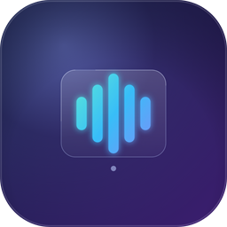
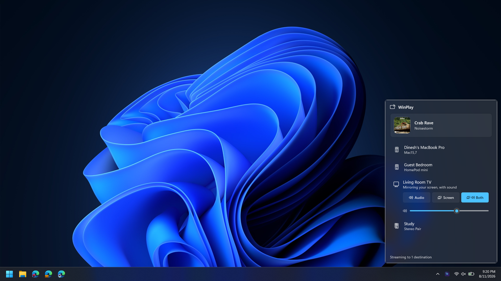
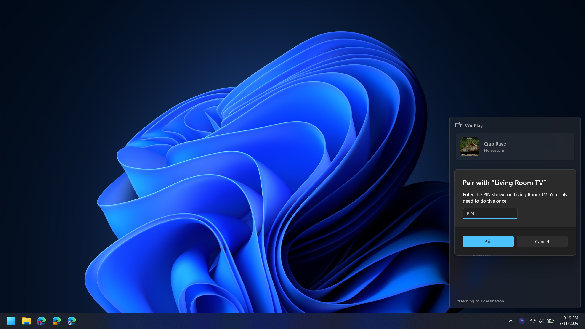

<div align="center">



# WinPlay

**A native Windows 11 AirPlay 2 sender.** Stream your PC's audio to HomePods, stereo pairs
and multi-room groups — mirror your screen to Apple TV — or do both at once, in sync, from
an iOS-style picker that lives in your system tray.

[](https://github.com/dineshdhotrad/WinPlay/actions/workflows/ci.yml)
[](LICENSE)
[](https://dotnet.microsoft.com/)
[](#requirements)
[](https://github.com/dineshdhotrad/WinPlay/releases)

</div>

---

## What it does

WinPlay speaks Apple's AirPlay 2 protocols natively — **no iTunes, no Bonjour service, no
third-party runtime.** Everything (mDNS discovery, HomeKit pairing, RTSP/RAOP, PTP timing,
FairPlay authentication, AAC-LC and ALAC audio, H.264 mirroring) is implemented from the
ground up in managed .NET, with a thin GPU/Media Foundation layer for the video hot path.

| | |
|---|---|
| 🔊 **System audio → any AirPlay 2 receiver** | HomePod, HomePod mini, **stereo pairs**, **multi-room groups**, Apple TV, AirPort Express, third-party AirPlay 2 speakers — with sample-accurate multi-room sync from a built-in **PTP grandmaster clock**. |
| 🎯 **Whole-home sample lock** | Every room WinPlay is streaming to renders the same captured instant at the same moment — buffered or realtime, one speaker or five. Packets carry **capture-true timestamps** on one wall-locked timeline at a **shared 1.75 s playout lead** (Apple's own captured operating point), so per-room skew isn't corrected after the fact, it's unrepresentable. The trade is deliberate: WinPlay optimises for *constant, identical* latency across the house, not for low latency. |
| 🎼 **AirPlay 2 buffered audio** | The **buffered stream** (type 103 over TCP) carrying **AAC-LC 44.1 kHz stereo** — the exact payload shape Apple's own senders use — anchored with `SETRATEANCHORTIME` once the receiver's PTP servo has measurably converged. Falls back to buffered ALAC if the AAC encoder is unavailable, and to the classic realtime stream (type 96, ALAC) for receivers that can't hold a PTP clock. All automatic, per receiver. |
| 🖥️ **Screen mirroring → Apple TV** | Desktop mirrored over the AirPlay 2 mirroring protocol with **FairPlay SAP** authentication, GPU capture + encode, and **resolution negotiated from the TV** (no hardcoded caps). |
| 🎬 **Screen + audio, in sync** | Apple TV's combined mode carries picture and sound in one mirror session on one clock, both pinned to the same 250 ms presentation delay — no separate audio destination to juggle, no drift to correct for. |
| 🎛️ **iOS-style picker** | A tray flyout that collapses stereo pairs and groups into single entries — just like Control Center — with per-destination volume, a Now Playing surface, light-dismiss, and a global hotkey (**`Win`+`Shift`+`A`**, remappable). |
| 🔑 **Pairing that just works** | Transient pairing for HomePods, on-screen **PIN pairing** for Apple TV, and fast **pair-verify** reconnects. Credentials are stored **DPAPI-encrypted**, and each receiver's identity is **pinned across sessions**. |
| 🎵 **Now Playing & remote control** | Your current track (title, artist, album, art) appears on the receiver — and the DACP verbs it sends back (transport keys, volume) are applied to the app playing on your PC. |
| ♻️ **Resilient** | Automatic reconnect with backoff; screen capture runs **crash-isolated** in a supervised child process; your PC's audio is never left muted, even after a crash; sessions always get a `TEARDOWN` on exit so receivers are never left holding a stale connection. |

## Screenshots

> Captured on a live LAN with real HomePods and an Apple TV.

<div align="center">

| The picker — Now Playing, collapsed rooms, and an Apple TV mirroring with sound |
|:--:|
|  |
| **One-time PIN pairing with an Apple TV** |
|  |

</div>

## Requirements

- **Windows 11** (also runs on Windows 10 21H1+; screen mirroring needs a Direct3D 11 GPU — Intel, AMD, NVIDIA, Qualcomm or MediaTek).
- **.NET 8 SDK** to build from source.
- An AirPlay 2 receiver on the same LAN.

## Quick start

### Install (for users)

Download the latest **`WinPlay-<version>-win-x64-Setup.exe`** from
[Releases](https://github.com/dineshdhotrad/WinPlay/releases) and run it. It installs
**per-user — no admin rights, no UAC prompt** — adds a Start Menu entry, and launches into
your system tray. A `win-arm64` build and a portable zip are attached too. Installing over
an existing copy upgrades in place and keeps your pairings.

Releases aren't code-signed yet, so on first run Windows SmartScreen will say **"Windows
protected your PC"** — this is normal for any new, unsigned app, not specific to WinPlay.
Click **More info → Run anyway**. See
[docs/INSTALL.md](docs/INSTALL.md#windows-protected-your-pc-smartscreen--what-to-expect)
for why, and what removes it.

### Run from source (for developers)

```powershell
git clone https://github.com/dineshdhotrad/WinPlay.git
cd WinPlay
dotnet run --project src/WinPlay.App
```

WinPlay appears in your system tray. **Left-click** the icon to open the picker, tick a
destination to start streaming your system audio, and use the slider to set its volume.
**Right-click** to quit. For an Apple TV, WinPlay walks you through the one-time PIN pairing.

### Use the CLI (power users / testing)

The `winplay` CLI is a scriptable harness for every capability:

```powershell
# Discover receivers on the LAN (collapsed, iOS-style)
dotnet run --project tools/WinPlay.DiscoveryCli -- discover

# Stream system audio to one or more destinations
# (the CLI defaults to realtime; add --buffered for the AAC-LC buffered stream)
dotnet run --project tools/WinPlay.DiscoveryCli -- play --to "Kitchen" --buffered
dotnet run --project tools/WinPlay.DiscoveryCli -- play --to "Kitchen,Office" --volume -12

# Pair an Apple TV (shows a PIN on the TV), then mirror your desktop to it
dotnet run --project tools/WinPlay.DiscoveryCli -- pair   --to "Den TV" --pin 1234
dotnet run --project tools/WinPlay.DiscoveryCli -- mirror --to "Den TV" --fps 60
```

See the **[full usage guide](docs/USAGE.md)** for every command and flag.

## Latency

WinPlay's audio design point is **constant** latency, identical in every room — not low
latency. Both audio transports render at the same **1.75 s playout lead** (77,175 frames at
44.1 kHz), which is Apple's own captured operating point and what survives real Wi-Fi under
load; smaller leads were measured and each collapsed at the first disturbance.

| Path | End-to-end delay | Notes |
|---|---|---|
| Buffered AirPlay 2 audio (type 103, AAC-LC) | **≈1.8–1.9 s**, constant | Default in the app wherever a room's speakers answer to nobody. The 1.75 s shared lead plus capture and encode. It does not creep: packets carry capture-true timestamps on a wall-locked timeline, so jitter can never shift audio later. |
| Realtime AirPlay audio (type 96, ALAC) | **≈1.8–1.9 s**, constant | Automatic per-device fallback for receivers that can't hold a PTP clock, and the transport used for Apple-TV-led home-theatre rooms. It declares the **same** 1.75 s lead on the same grid, so a realtime room and a buffered room stay phase-locked with each other. |
| First connect to a given receiver (buffered) | **+5–7 s once** | WinPlay waits for the receiver's PTP servo to demonstrably converge before anchoring playback. Once per receiver per app run — later connections in the same run skip the wait. |
| Screen mirroring (with or without audio) | **≈0.25 s** presentation delay | Video and, in combined mode, audio are pinned to one shared 250 ms budget and timestamped from the same capture instant, so the two stay aligned rather than racing each other. |

## How it works

```
┌────────────────────────────────────────────────────────────────────┐
│  WinPlay.App (WinUI 3 tray flyout)        WinPlay.DiscoveryCli       │
├────────────────────────────────────────────────────────────────────┤
│  WinPlay.Capture   DXGI Desktop Duplication → D3D11 VideoProcessor   │
│  (Windows, GPU)    (NV12) → Media Foundation H.264                   │
├────────────────────────────────────────────────────────────────────┤
│  WinPlay.Core (portable, unit-tested)                                │
│    Discovery  mDNS/DNS-SD, feature-bit parsing, group collapse       │
│    Hap        SRP-6a pairing, pair-verify, ChaCha20 channels         │
│    Fairplay   FairPlay SAP whitebox (verified against golden vectors)│
│    Raop       RTSP/RAOP, AAC-LC + ALAC, buffered + realtime, DACP    │
│    Ptp        AirPlay-2 PTP grandmaster clock                        │
│    Mirror     mirroring session, video framing + crypto              │
├────────────────────────────────────────────────────────────────────┤
│  WinPlay.Diagnostics   structured logs, redacted bug-report bundles  │
└────────────────────────────────────────────────────────────────────┘
```

The flow, end to end: **mDNS discovery** finds receivers and decodes their capability
bitfields → **RTSP + HomeKit pairing** (SRP-6a / pair-verify) opens an authenticated,
encrypted control channel → a **PTP grandmaster clock** running on the PC gives every
receiver a common timeline → **AAC-LC or ALAC audio over RTP** (or H.264 video,
FairPlay-authenticated) streams against that timeline.

`WinPlay.Core` has no Windows-UI or GPU dependencies and is covered by the test suite.
Read the **[architecture guide](docs/ARCHITECTURE.md)** for the full protocol detail.

## Engineering notes

AirPlay 2's buffered audio mode isn't documented anywhere — getting it working meant reading
receiver behavior, not a spec. Every failure below is silent by construction: the handshake
succeeds, keep-alives flow, `streams` reports healthy, and the speaker makes no sound. Each
had to be settled with controlled A/B listening tests rather than log reading. The
interesting parts are left in the code as comments, not buried in a commit message:

- **Receivers publish a different format table per stream type.** `GET /info` returns a
  `supportedFormats` dictionary with a bitmask *per stream type* — `audioStream` for
  realtime, `bufferStream` for buffered — and the two aren't the same set. A receiver that
  accepts 16-bit ALAC on realtime can require 24-bit on the buffered stream; sending the
  wrong one doesn't error, it just holds the session open and renders silence. WinPlay reads
  the device's own table instead of hardcoding a format.
- **The codec tag hides in the SSRC field.** On stream type 103 the RTP SSRC is not a
  synchronisation source at all — it names the payload codec, and a value the receiver
  doesn't recognise means the packet is counted and dropped without ever being decrypted.
  Buffered streams carry **AAC-LC 44.1 kHz stereo** (raw 1024-sample access units, ~192
  kbit/s, tag `0x16000000`), which is what real Apple senders send. The uncompressed 24-bit
  ALAC alternative is ~2.1 Mbit/s per speaker — ten times heavier — and starved a speaker on
  a marginal Wi-Fi link: 19 s of cumulative TCP send stalls inside a 15-second window, with
  every protocol instrument reading clean.
- **The buffered anchor is discarded if it's sent too early.** Buffered playback starts with
  a single `SETRATEANCHORTIME` call that promises "this sample plays at this instant" — but
  a receiver whose PTP servo hasn't yet converged on WinPlay's clock silently drops that
  message and never renders. WinPlay waits on the receiver's own `Delay_Req` traffic — direct
  evidence its servo is tracking — before sending the anchor. On real hardware that
  convergence takes on the order of 6 seconds on first contact with a receiver.
- **One shared timeline, not a relay.** A stereo pair or a multi-room group gets one
  coordinated RTSP session per member, all slaved to the same PTP grandmaster and given the
  same start timestamp and anchor — instead of one device forwarding audio to the others.
  Timestamps are **capture-true**: a packet is stamped with the wall position of the audio it
  carries, not with the slot it happens to be sent in, so rooms whose packets are different
  sizes (1024-sample AAC, 352-sample ALAC) still render the same captured instant at the same
  moment. Slot-based stamps put each pump's private send offset into the timestamps
  themselves — a fixed cross-room flam no receiver could correct.

The grandmaster clock itself uses a MAC-derived EUI-64 clock identity (IEEE 1588-2008
§7.5.2.2.2) so it's stable across restarts — a receiver that has already locked onto WinPlay's
clock doesn't have to start over just because the app restarted.

## Building

```powershell
./build.ps1                 # every project + every test, exactly as CI runs it
./build.ps1 -SkipTests      # build only, while chasing a compile error
```

`build.ps1` is the same script CI runs, which is the point: the tools project consumes
internal `WinPlay.Core` APIs, so building only the project you are editing can leave a
consumer broken and you would not find out until CI. Everything builds with
`-warnaserror` — WinPlay holds a zero-warning bar.

Individual projects still build normally when you want a faster loop:

```powershell
dotnet build src/WinPlay.Core          # protocol core
dotnet build src/WinPlay.Capture       # GPU capture/encode (Windows)
dotnet build src/WinPlay.App           # the tray app
dotnet test  tests/WinPlay.Core.Tests  # protocol + discovery tests
```

WinPlay is **100% managed .NET** — no native toolchain required. The GPU capture/encode
path uses Direct3D 11 and Media Foundation through managed bindings.

## Project layout

| Path | What's in it |
|---|---|
| `src/WinPlay.Core` | The protocol engine — discovery, pairing, PTP, RAOP (buffered AAC-LC and realtime ALAC), FairPlay SAP, mirroring session logic. Plain `net8.0`, no UI or GPU dependency, fully unit-tested. |
| `src/WinPlay.Capture` | Windows-only media codecs — screen capture and H.264 encode (DXGI Desktop Duplication, Direct3D 11, Media Foundation) plus the AAC-LC encoder the buffered audio path uses. |
| `src/WinPlay.App` | The WinUI 3 tray app — flyout picker, tray icon, hotkey, settings. |
| `src/WinPlay.Diagnostics` | Structured file logging and the redacted diagnostics-bundle exporter. |
| `tests/` | xUnit test projects mirroring `Core`, `Capture` and `Diagnostics`. |
| `tools/WinPlay.DiscoveryCli` | The scriptable CLI harness used above. |
| `installer/` | The Inno Setup script (`winplay.iss`) and release notes. |
| `docs/` | Install, usage, architecture and troubleshooting guides. |

## Compatibility

Verified on a live network against:

| Device | Audio | Mirroring |
|---|---|---|
| HomePod mini (single) | ✅ buffered AAC-LC (realtime also verified) | — (HomePods are audio-only) |
| HomePod stereo pair | ✅ buffered AAC-LC, one session per member | — |
| Apple-TV-led home-theatre room | ✅ realtime, streamed **directly to the room's speakers** | — |
| Apple TV 4K (`AppleTV11,1`, tvOS) | ⚠️ audio-only doesn't render — see limitations below | ✅ 2560×1440 @ 60 fps, plus combined Screen+Audio (mirror audio does play) |
| Third-party AirPlay 2 speaker (Shairport Sync) | ✅ realtime ALAC (no PTP → no buffered path) | — |

### Known limitations

- **Audio-only to an Apple TV is silent.** tvOS does not render a third-party audio-only
  session: WinPlay's session is accepted in full — PTP or NTP timing, ALAC or AAC-LC,
  realtime or buffered, all tested on real hardware — and simply never played. The same
  Apple TV renders the audio inside a *mirroring* session perfectly, so pairing, FairPlay and
  keys are not the gate. It is the same wall as pyatv's long-open
  [postlund/pyatv#1666](https://github.com/postlund/pyatv/issues/1666). **Screen** and
  **Screen + Audio** to an Apple TV work fully, and for an Apple-TV-led home-theatre room
  WinPlay streams audio straight to the room's speakers rather than through the TV.
- **Buffered audio needs a PTP-capable receiver.** Anything else transparently uses the
  realtime path — at the same playout lead, so it stays in sync with every other room.
- **Latency is ~1.8 s by design**, not a bug to be tuned away — see [Latency](#latency).
- **Screen mirroring is SDR H.264 only**; HDR10 / Dolby Vision and HEVC are on the roadmap.
- **HomePod pause/next from the Home app** use Apple's proprietary MRP protocol rather than
  DACP. WinPlay implements the DACP verbs (volume from the device works today); MRP is on the
  roadmap.
- **Releases aren't code-signed yet**, so SmartScreen warns on first run.

## Troubleshooting

- **Logs** roll daily into `%LOCALAPPDATA%\WinPlay\logs`. Run with `--verbose` or `--trace`
  for more detail before reproducing a problem.
- **Right-click the tray icon → Export diagnostics…** writes a redacted
  `winplay-diagnostics-*.zip` to your desktop — recent logs plus version/OS details, with
  pairing credentials excluded and all key material scrubbed before the file is written.
  Attach it to a GitHub issue.
- Common problems (no devices found, `470`/`400` RTSP errors, silent audio-only to an Apple
  TV, only one speaker of a pair playing, mirroring a black screen) and their fixes are in
  the **[troubleshooting guide](docs/TROUBLESHOOTING.md)**.

## Roadmap

WinPlay's audio (buffered and realtime) and SDR screen mirroring, including combined
screen + audio, are complete and battle-tested. On the roadmap:

- **Hardware HEVC + HDR10 / Dolby Vision** mirroring (the pipeline keeps codec and pixel
  format as explicit extension points).
- **True hardware async encode** across all GPU vendors (software encode already sustains
  1440p60 in real time).
- **MRP**, so the Home app's transport controls for a HomePod reach the PC the way DACP
  already does.
- Code signing, to remove the SmartScreen warning on first run.

See the [changelog](CHANGELOG.md) for release history.

## Security & privacy

WinPlay talks only to receivers on your local network, and makes **no** outbound connections
otherwise — there is no telemetry, and the logging stack has no network sink compiled in.
Pairing credentials are stored DPAPI-encrypted under your Windows user account, and each
receiver's identity is **pinned across sessions**: Apple TVs are verified cryptographically
on every reconnect, and a HomePod whose advertised identity changes is refused rather than
streamed to. See [SECURITY.md](SECURITY.md) for the threat model and the exact guarantees.

## Contributing

Issues and pull requests are welcome — see [CONTRIBUTING.md](CONTRIBUTING.md) and the
[code of conduct](CODE_OF_CONDUCT.md).

## Support WinPlay

WinPlay is free and open source, built in the open. If it earned a place in your setup,
you can support continued development over on **[Ko-fi ☕](https://ko-fi.com/thedinesh)** —
every bit is appreciated and keeps the project moving.

## Acknowledgements

WinPlay contains **no Apple source code or Apple key material.** Where it interoperates with
Apple's undocumented AirPlay 2 protocols, it does so through independent implementation,
informed by the open-source AirPlay community: most directly
[doubletake](https://github.com/omarroth/doubletake) (FairPlay SAP, ported under LGPL-3.0)
and [owntone](https://github.com/owntone/owntone-server) (PTP grandmaster construction,
ported under MIT). RAOP/RTSP behavior, HAP pairing and the mirroring SETUP contract were
also studied — with no code copied — in
[pyatv](https://github.com/postlund/pyatv),
[airplay2-receiver](https://github.com/openairplay/airplay2-receiver),
[UxPlay](https://github.com/FDH2/UxPlay),
[shairport-sync](https://github.com/mikebrady/shairport-sync) and
[nqptp](https://github.com/mikebrady/nqptp). Full credits and licenses are in
[THIRD_PARTY_NOTICES.md](THIRD_PARTY_NOTICES.md).

## License

**GPL-3.0-or-later** — see [LICENSE](LICENSE). This is required because WinPlay's FairPlay
module derives from the LGPL-3.0 doubletake project, and it matches the copyleft licensing
that is standard across the open-source AirPlay ecosystem.

<div align="center">
<sub>Built by Dinesh Dhotrad · not affiliated with or endorsed by Apple Inc. · AirPlay is a trademark of Apple Inc.</sub>
</div>
